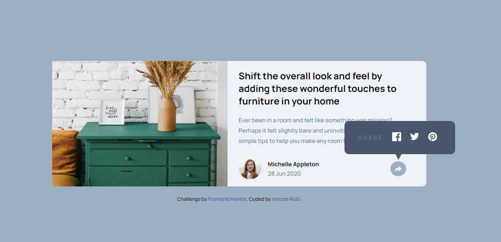

# Frontend Mentor - Article preview component solution

  

This is a solution to the [Article preview component challenge on Frontend Mentor](https://www.frontendmentor.io/challenges/article-preview-component-dYBN_pYFT). Frontend Mentor challenges help you improve your coding skills by building realistic projects.

  

## Table of contents

  

- [Overview](#overview)

- [The challenge](#the-challenge)

- [Screenshot](#screenshot)

- [Links](#links)

- [My process](#my-process)

- [Built with](#built-with)

- [What I learned](#what-i-learned)

- [Author](#author)

  
  

## Overview

  

### The challenge

  

Users should be able to:

  

- View the optimal layout depending on their device's screen size

- See hover and focus states for interactive elements

  

### Screenshot

  



  

### Links

  

- Solution URL: [GitHub](https://github.com/MarcosRubi/Article-preview-componentt)

- Live Site URL: [GitHub Pages](https://marcosrubi.github.io/Article-preview-component/)

  

## My process

  

### Built with

  

- Pug

- SCSS

- Semantic HTML5 markup

- CSS custom properties

- Flexbox

- Mobile-first workflow

  
  

### What I learned

  

i learned create shapes with CSS. [Documentation](https://www.freecodecamp.org/news/css-shapes-explained-how-to-draw-a-circle-triangle-and-more-using-pure-css/)

  ```css

.card__content--hover::after {
content: "";
width: 0;
height: 0;
border-left: 50px  solid  #48556a;
border-top: 25px  solid  transparent;
border-bottom: 25px  solid  transparent;
position: absolute;
transform: rotate(90deg);
z-index: -1;
top: 37px;
left: 95px;
}
```
  

## Author

  

- Website - [Marcos Rubí](https://mrubi.vercel.app/)

- Frontend Mentor - [@MarcosRubi](https://www.frontendmentor.io/profile/MarcosRubi)